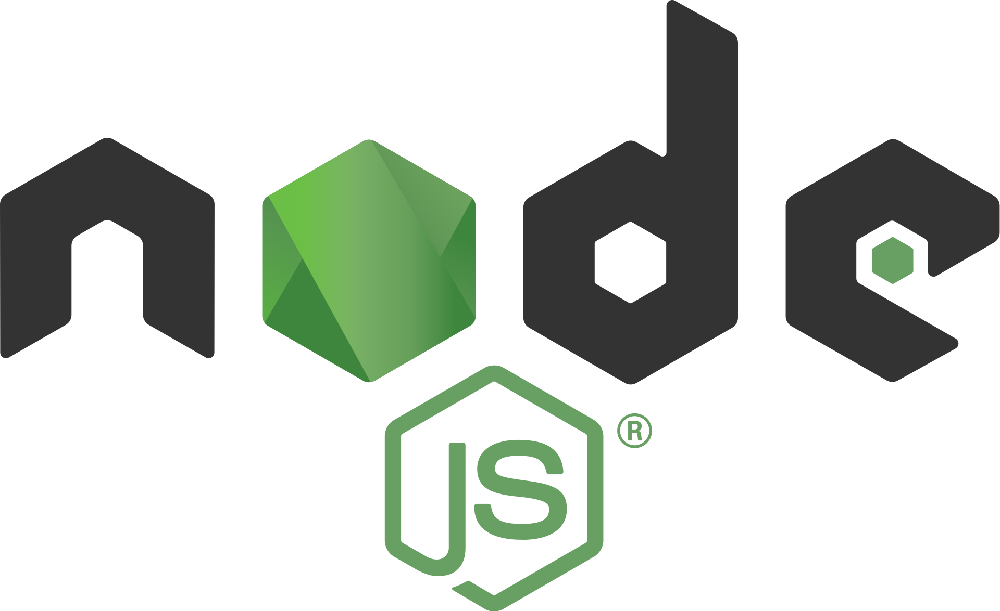

### Test and handling environment

__v.0.1.0__

Node.js and Express.js code repository, it contains several examples of possible data manipulations, especially with the Express.Js framework.

- **Getting started**
- **SQL data management**
- **Star-Trek : External API**

#### 1. Getting started

Clone the repository.

Use the `npm install` command.

Copy the `.env.sample` file to `.env` and replace the values ​​to correctly connect your MySQL database and port.

The repository uses __nodemon__, so you can modify the __package.json__ in the script.

`"scripts": {
"start": "nodemon src/index.js"
},`

and replace `src/index.js` with `src/"Your JavaScript file name"` if you want use another startup file.

Launch `npm start`.

Very well ! You are ready to go to the various endpoints to manipulate the data.

#### 2. SQL data management

The index.js file shows an example of a REST API that uses the different routes types. Request/Responses are mainly done with a MySQL database. The sample SQL files are located in the data folder. __movies.js__ also provides a small, fast dataset.

#### 3. Star-Trek : External API

This section shows the manipulation of JavaScript object and data in JSON format related to an external API that lists the episodes of the Star-Trek series in the __startrek.json__ file.

The Challenge specific to this file is described <a href="https://www.notion.so/Interview-api-problem-solving-f9ce018ed4404d9f929e55de58f33347">right here</a>.

**

More improvement to come.